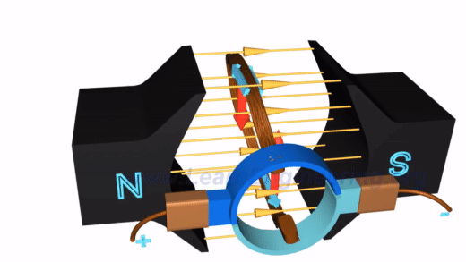
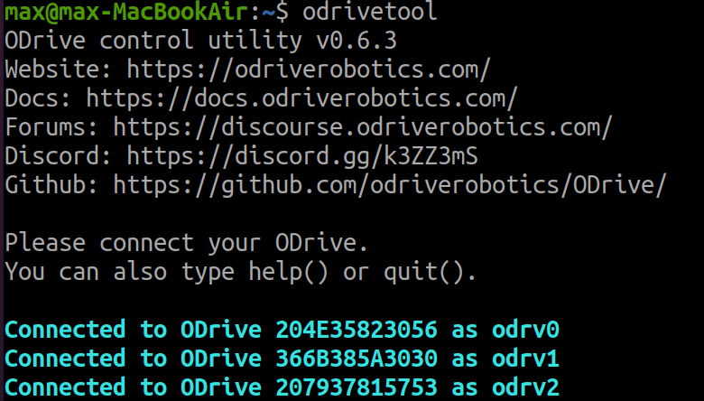

# Drive 2022-2023

# ODrive
- ESC -> electronic speed controller
- Our's is odrive v3.6 56volts
- for **BRUSHLESS** motors only
- all functions of the odrive are controlled by `odrivetool`

  - 

# Neo Motors
- Neo motors are **BRUSHLESS**
- perhaps an inrunner type motor
- what brushed / brushless
---
  ### Brushed
  - two wires, + / -
  - can be plugged directly into a battery
  - force is applied when current is present in a magnetic field, gets the motor to turn
    - This only can do a half turn
    - so, polarity is switched every half turn
      
      - commutator has gaps
      - brushes can reverse polarity every turn
      - inefficient because brushes will wear out
---
  ### Brushless (Matin do this)
  - three wires; goes into esc (electronic speed controller)
  - Coils are not located on the rotor like Brushed motor
  - The Rotor is fixed
---
  - **NEED AN ESC** (like an odrive)
    


# Plugging things into an Odrive

  ### ODrive and NEOs
  - whether through user error or not, **we have found the odrives to be very unreliable**
  - Although unconfirmed, we think only some motors work paired with others
    - one combination we have found
    ```
    ┌──────────────────┐  ┌──────────────────┐  ┌──────────────────┐
    │     ODRIVE 5     │  │     ODRIVE 1     │  │     ODRIVE 2     │
    │   M1        M0   │  │   M1        M0   │  │   M1        M0   │
    └──────────────────┘  └──────────────────┘  └──────────────────┘
      ║ ║ ║      ║ ║ ║      ║ ║ ║      ║ ║ ║      ║ ║ ║      ║ ║ ║
      ║ ║ ║      ║ ║ ║      ║ ║ ║      ║ ║ ║      ║ ║ ║      ║ ║ ║
      ║ ║ ║      ║ ║ ║      ║ ║ ║      ║ ║ ║      ║ ║ ║      ║ ║ ║
      ║ ║ ║      ║ ║ ║      ║ ║ ║      ║ ║ ║      ║ ║ ║      ║ ║ ║
     .-----.    .-----.    .-----.    .-----.    .-----.    .-----.
    (  NEO  )  (  NEO  )  (  NEO  )  (  NEO  )  (  NEO  )  (  NEO  )
    |~-----~|  |~-----~|  |~-----~|  |~-----~|  |~-----~|  |~-----~|
    | LEFT  |  | RIGHT |  | LEFT  |  | LEFT  |  | RIGHT |  | RIGHT |
    | BACK  |  | MIDDLE|  | FRONT |  | MIDDLE|  | FRONT |  | BACK  |
    └───────┘  └───────┘  └───────┘  └───────┘  └───────┘  └───────┘
    ```
### Neo Encoders
  - Hall Encoders have 6 Wires
    - We only use 5
    - Here are how they plug into an odrive
    ```
    3.3V  ▣
      5V  ▣ 🟥🟥🟥🟥🟥
       A  ▣ 🟦🟦🟦🟦🟦  
       B  ▣ 🟨🟨🟨🟨🟨
       Z  ▣ 🟩🟩🟩🟩🟩
     GND  ▣ ⬛⬛⬛⬛⬛
    3.3V  ▣
      5V  ▣ 🟥🟥🟥🟥🟥
       A  ▣ 🟦🟦🟦🟦🟦  
       B  ▣ 🟨🟨🟨🟨🟨
       Z  ▣ 🟩🟩🟩🟩🟩
     GND  ▣ ⬛⬛⬛⬛⬛
    ```

---
# Odrive tool

- terminal based program
  - `odrv`
    - when odrive is connected, it is assigned a number
      
      - so start a command with `odrv0`, `odrv1`, or `odrv2`
      - each odrive has two axes, `axis0` or `axis1`
        - join attributes with `.`

  ## odrivetool in python
  - three key dependies
  - `import odrive`
    - 
  - `from odrive.enums import *`
  - `from fibre.libfibre import ObjectLostError`