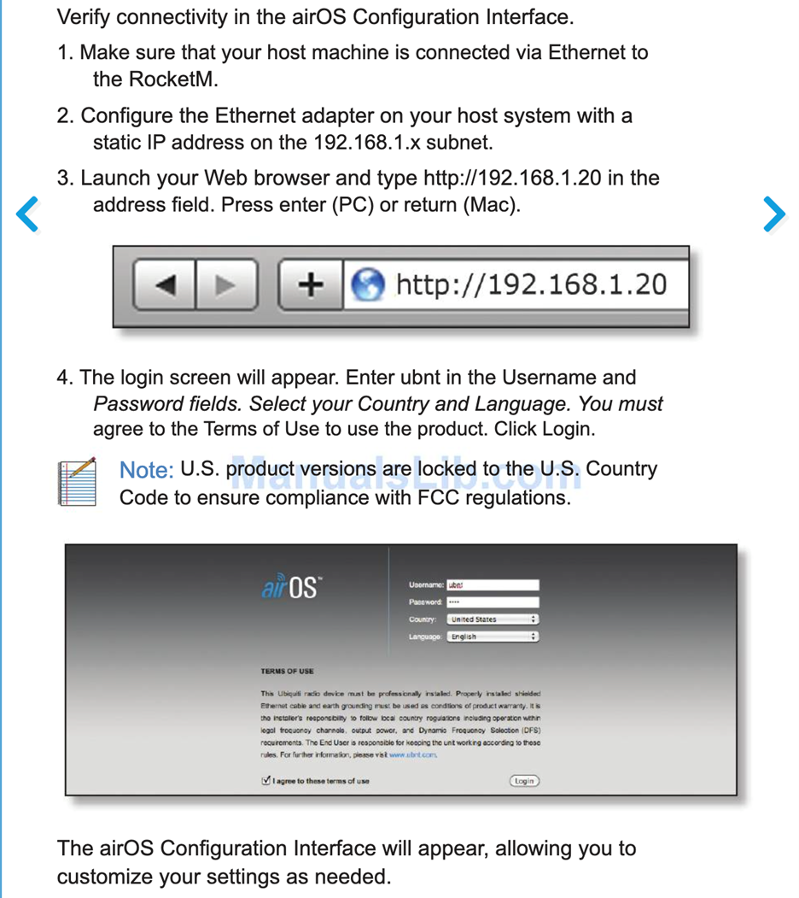
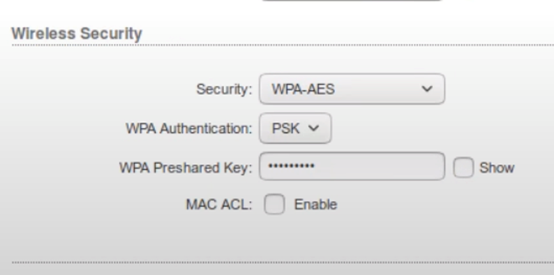
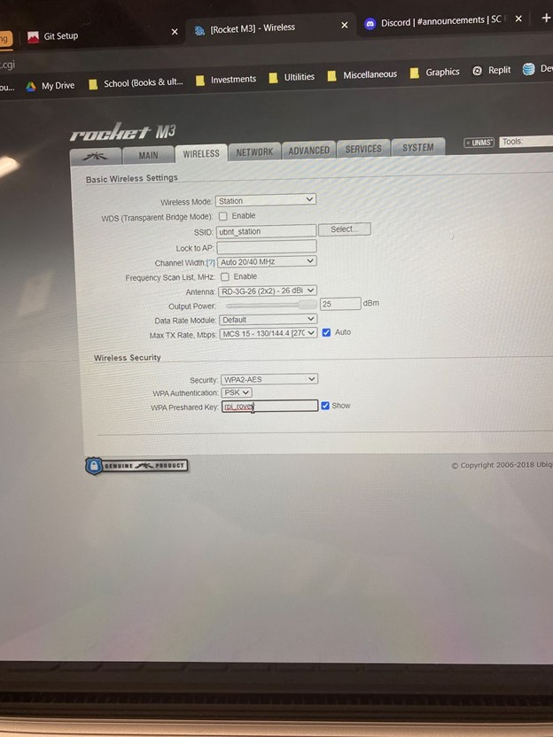
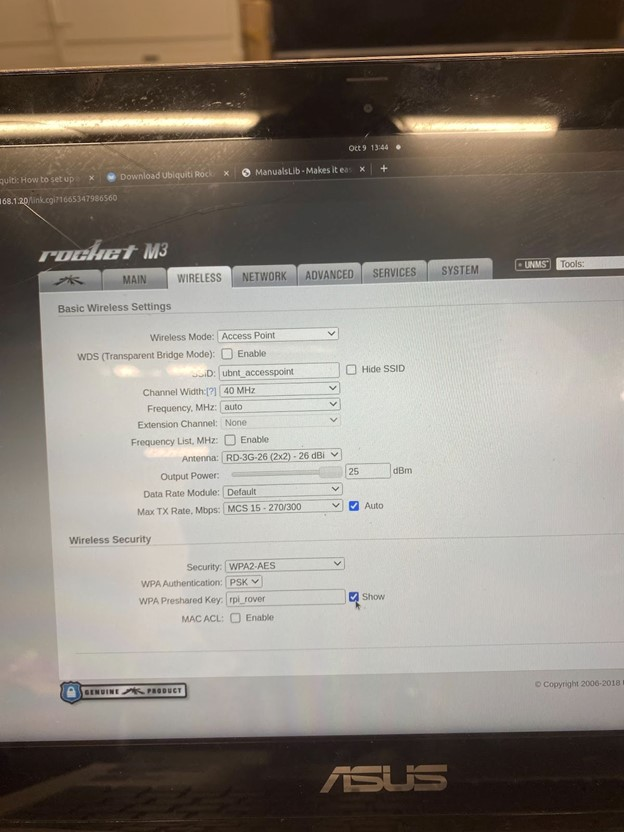
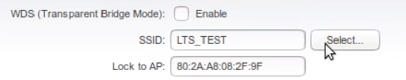
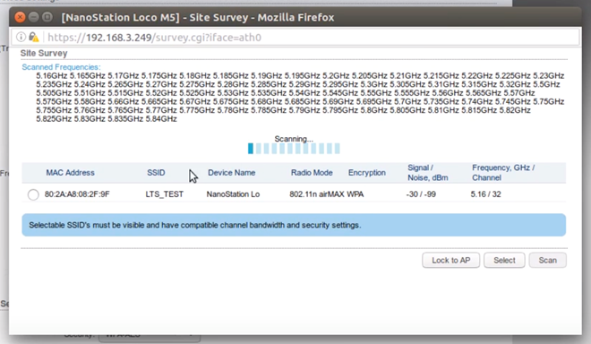

# Base Station & Antenna Setup
## Setup
Set up antennas on the rover / base station
- First login Rocket M3, airOs, and set up the antennas.

- You'd need to reset the device first (look for manual - there should be a reset button on the Rocket M3). 
- After reset, the DEFAULT `username` and `password` are `ubnt`. 
    + RECOMMENDATION: changing your `ip address`, `ssid`, and `passwords` after reset. 
    + IP and gateway IP should match the network configuration so that the devices have network to update the firmware.

- Then, set up the antennas’ network mode: one is set to “station” and the other is set to “access point”. In our SCR 2022-23 case, we had it set to `ubnt_station` & `ubnt_accesspoint`.
    + RECOMMENDATION: Play around with the tools ¯\\_(ツ)_/¯

- Set up wireless security:
    + Security: `WPA2-AES`
    + WPA Authentication: `PSK`
    + RECECOMMENDATION: I'd just set your password to something simple, and used across everything. Unless you're worried about security then PLEASE write that down.

## Our current setup for Base Station

## Our current setup for Base Station

## Bridging point to point connection between 2 antennas
- Log into ubnt_station, and go to `Wireless` setting

- Choose SELECT, and a window of all the access point device will show up
- Choose the access point device you want to connect to, and click `Lock to AP`

- Apply the changes, and you should now have a point to point connection between the 2 antennas. Try sshing into Ymir to see if you can connect to the other antenna.
    + **NOTE:**
    + Ymir (Raspberry Pi) is hooked up to a switch, which is hooked up to a antenna. See Diagram for more details.
    + Your machine should be hooked up to the base station antenna, and you should be able to ssh into Ymir through the other antenna.
    + You can do `arp -a` on Ymir (not on your local machine - `ssh` into Ymir) to see all the other Pis' IP addresses (that are hooked up to a switch).

## Additional Resources
### Tools:
- **UBNT:** [How to set up RocketM3](https://dl.ubnt.com/qsg/RocketM-Series/RocketM-Series_EN.html)
- **DL.UI:** [How to set up BulletAC-IP67](https://dl.ui.com/qsg/BulletAC-IP67/BulletAC-IP67_EN.html)
 
### Antenna:
- **ANTENNA-THEORY:** [What is Antenna Gain](https://antenna-theory.com/basics/gain.php)